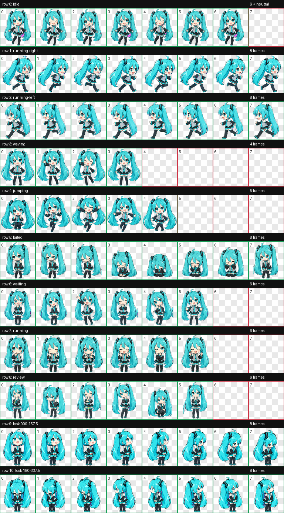
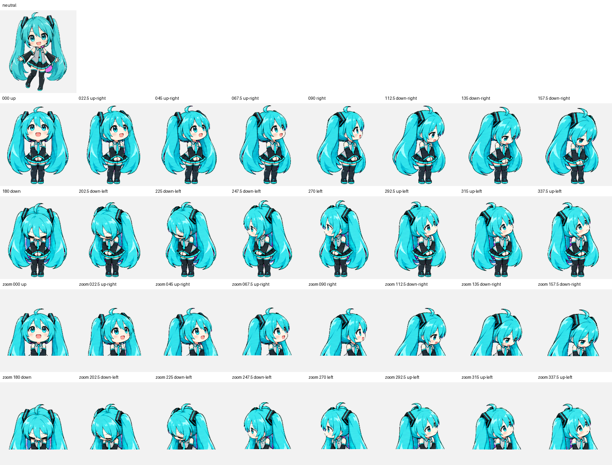

# Miku Mini · 未来喵

一个以初音未来为灵感的 Codex v2 桌面宠物作品集项目。

## 作品简介

Miku Mini 是一只青绿色双马尾的 Q 版未来感虚拟偶像桌宠，采用贴纸风格、清晰深色描边和简洁赛璐璐阴影。她包含待机、左右移动、挥手、跳跃、失败、等待、任务处理中、审阅，以及 16 个连续注视方向。

## 技术规格

- Codex sprite version: `2`
- Atlas: `8 × 11`
- Cell size: `192 × 208`
- Spritesheet: `1536 × 2288` RGBA WebP
- Standard animation rows: 9
- Look directions: 16 clockwise directions
- Chroma cleanup: deterministic edge-local despill

## 动作与注视机制

标准动作行遵循 Codex 宠物语义；注视方向采用人形角色的自然机制：眼睛先引导视线，眼睑和眉毛参与，头颈与上身小幅跟随，脚和下半身保持锚定，双马尾平滑滞后，不旋转整张角色。

## 文件

- `assets/spritesheet.webp`：可用于 Codex 的最终 v2 图集
- `pet.json`：宠物元数据
- `assets/contact-sheet.png`：11 行完整预览
- `docs/`：图集验证、去色、方向语义和视觉 QA 记录

## 验证结果

最终图集已通过：

- `1536 × 2288`、8×11、192×208 单元格验证
- `spriteVersionNumber: 2`
- 透明残留像素为 0
- 标准动作逐帧结构检查
- 四基准方向和 16 方向语义检查
- 水平/垂直盲向检查（中间斜向保留少量 minor warning）

## 使用

将 `pet.json` 与 `assets/spritesheet.webp` 放在 Codex 自定义宠物目录中即可。当前本机安装位置为：

`%USERPROFILE%\\.codex\\pets\\miku-mini`

## License

Personal portfolio artwork. All rights reserved unless otherwise stated.
